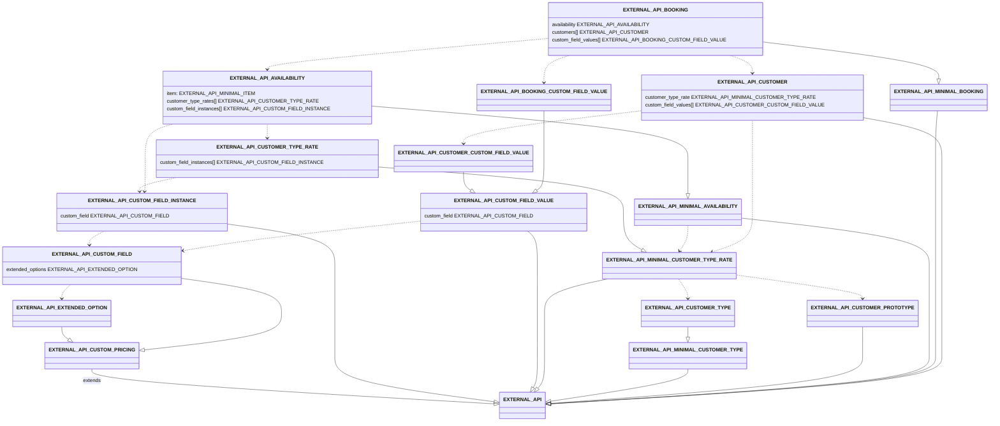

```mermaid

classDiagram
    direction BT

    EXTERNAL_API <|-- EXTERNAL_API_CUSTOM_PRICING: extends
    EXTERNAL_API_CUSTOM_PRICING <|-- EXTERNAL_API_EXTENDED_OPTION
    EXTERNAL_API_CUSTOM_PRICING <|-- EXTERNAL_API_CUSTOM_FIELD
    EXTERNAL_API_EXTENDED_OPTION <.. EXTERNAL_API_CUSTOM_FIELD
    EXTERNAL_API <|-- EXTERNAL_API_CUSTOM_FIELD_INSTANCE
    EXTERNAL_API_CUSTOM_FIELD <.. EXTERNAL_API_CUSTOM_FIELD_INSTANCE
    EXTERNAL_API <|-- EXTERNAL_API_CUSTOM_FIELD_VALUE
    EXTERNAL_API_CUSTOM_FIELD <.. EXTERNAL_API_CUSTOM_FIELD_VALUE

    EXTERNAL_API <|-- EXTERNAL_API_MINIMAL_CUSTOMER_TYPE_RATE
    EXTERNAL_API_MINIMAL_CUSTOMER_TYPE <|-- EXTERNAL_API_CUSTOMER_TYPE
    EXTERNAL_API <|-- EXTERNAL_API_MINIMAL_CUSTOMER_TYPE
    EXTERNAL_API <|-- EXTERNAL_API_CUSTOMER_PROTOTYPE
    EXTERNAL_API_CUSTOMER_TYPE <.. EXTERNAL_API_MINIMAL_CUSTOMER_TYPE_RATE
    EXTERNAL_API_CUSTOMER_PROTOTYPE <.. EXTERNAL_API_MINIMAL_CUSTOMER_TYPE_RATE
    EXTERNAL_API_CUSTOM_FIELD_INSTANCE <.. EXTERNAL_API_CUSTOMER_TYPE_RATE
    EXTERNAL_API_MINIMAL_CUSTOMER_TYPE_RATE <|-- EXTERNAL_API_CUSTOMER_TYPE_RATE

    EXTERNAL_API <|-- EXTERNAL_API_MINIMAL_AVAILABILITY
    EXTERNAL_API_MINIMAL_CUSTOMER_TYPE_RATE <.. EXTERNAL_API_MINIMAL_AVAILABILITY
    EXTERNAL_API_MINIMAL_AVAILABILITY <|-- EXTERNAL_API_AVAILABILITY
    EXTERNAL_API_CUSTOM_FIELD_INSTANCE <.. EXTERNAL_API_AVAILABILITY
    EXTERNAL_API_CUSTOMER_TYPE_RATE <.. EXTERNAL_API_AVAILABILITY
    
    EXTERNAL_API <|-- EXTERNAL_API_MINIMAL_BOOKING
    EXTERNAL_API_MINIMAL_BOOKING <|-- EXTERNAL_API_BOOKING
    EXTERNAL_API_AVAILABILITY <.. EXTERNAL_API_BOOKING
    EXTERNAL_API_BOOKING_CUSTOM_FIELD_VALUE <.. EXTERNAL_API_BOOKING
    EXTERNAL_API_CUSTOMER <.. EXTERNAL_API_BOOKING

    EXTERNAL_API <|-- EXTERNAL_API_CUSTOMER
    EXTERNAL_API_MINIMAL_CUSTOMER_TYPE_RATE <.. EXTERNAL_API_CUSTOMER
    EXTERNAL_API_CUSTOMER_CUSTOM_FIELD_VALUE <.. EXTERNAL_API_CUSTOMER

    EXTERNAL_API_CUSTOM_FIELD_VALUE <|-- EXTERNAL_API_CUSTOMER_CUSTOM_FIELD_VALUE
    EXTERNAL_API_CUSTOM_FIELD_VALUE <|-- EXTERNAL_API_BOOKING_CUSTOM_FIELD_VALUE 

    class EXTERNAL_API_MINIMAL_BOOKING {
    }

    class EXTERNAL_API_BOOKING {
        availability EXTERNAL_API_AVAILABILITY
        customers[] EXTERNAL_API_CUSTOMER
        custom_field_values[] EXTERNAL_API_BOOKING_CUSTOM_FIELD_VALUE
    }
    EXTERNAL_API_CUSTOM_FIELD : extended_options EXTERNAL_API_EXTENDED_OPTION

    EXTERNAL_API_CUSTOM_FIELD_INSTANCE: custom_field EXTERNAL_API_CUSTOM_FIELD

    EXTERNAL_API_CUSTOM_FIELD_VALUE: custom_field EXTERNAL_API_CUSTOM_FIELD

    EXTERNAL_API_CUSTOMER_TYPE_RATE: custom_field_instances[] EXTERNAL_API_CUSTOM_FIELD_INSTANCE

    class EXTERNAL_API_MINIMAL_CUSTOMER_TYPE_RATE{
    }

    class EXTERNAL_API_AVAILABILITY {
        item: EXTERNAL_API_MINIMAL_ITEM
        customer_type_rates[] EXTERNAL_API_CUSTOMER_TYPE_RATE
        custom_field_instances[] EXTERNAL_API_CUSTOM_FIELD_INSTANCE
    }

    class EXTERNAL_API_MINIMAL_AVAILABILITY {
    }

    class EXTERNAL_API_CUSTOMER {
        customer_type_rate EXTERNAL_API_MINIMAL_CUSTOMER_TYPE_RATE
        custom_field_values[] EXTERNAL_API_CUSTOMER_CUSTOM_FIELD_VALUE
    }

```
