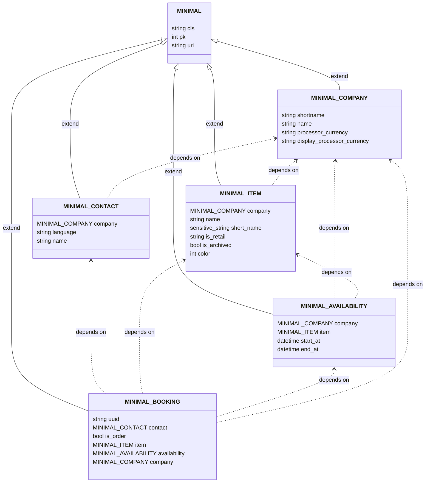

```mermaid
classDiagram
  direction BT

  
  class MINIMAL_BOOKING {
    string uuid
    MINIMAL_CONTACT contact
    bool is_order
    MINIMAL_ITEM item
    MINIMAL_AVAILABILITY availability
    MINIMAL_COMPANY company
  }
  MINIMAL_BOOKING --|> MINIMAL : extend
  MINIMAL_BOOKING ..> MINIMAL_CONTACT : depends on
  MINIMAL_BOOKING ..> MINIMAL_ITEM : depends on
  MINIMAL_BOOKING ..> MINIMAL_AVAILABILITY : depends on
  MINIMAL_BOOKING ..> MINIMAL_COMPANY : depends on
  
  class MINIMAL_CONTACT {
    MINIMAL_COMPANY company
    string language
    string name
  }
  MINIMAL_CONTACT --|> MINIMAL : extend
  MINIMAL_CONTACT ..> MINIMAL_COMPANY : depends on
  
  class MINIMAL_ITEM {
    MINIMAL_COMPANY company
    string name
    sensitive_string short_name
    string is_retail
    bool is_archived
    int color
  }
  MINIMAL_ITEM --|> MINIMAL : extend
  MINIMAL_ITEM ..> MINIMAL_COMPANY : depends on
  
  class MINIMAL_AVAILABILITY {
    MINIMAL_COMPANY company
    MINIMAL_ITEM item
    datetime start_at
    datetime end_at
  }
  MINIMAL_AVAILABILITY --|> MINIMAL : extend
  MINIMAL_AVAILABILITY ..> MINIMAL_COMPANY : depends on
  MINIMAL_AVAILABILITY ..> MINIMAL_ITEM : depends on
  
  class MINIMAL_COMPANY {
    string shortname
    string name
    string processor_currency
    string display_processor_currency
  }
  MINIMAL_COMPANY --|> MINIMAL : extend
  
  class MINIMAL {
    string cls
    int pk
    string uri
  }

```
