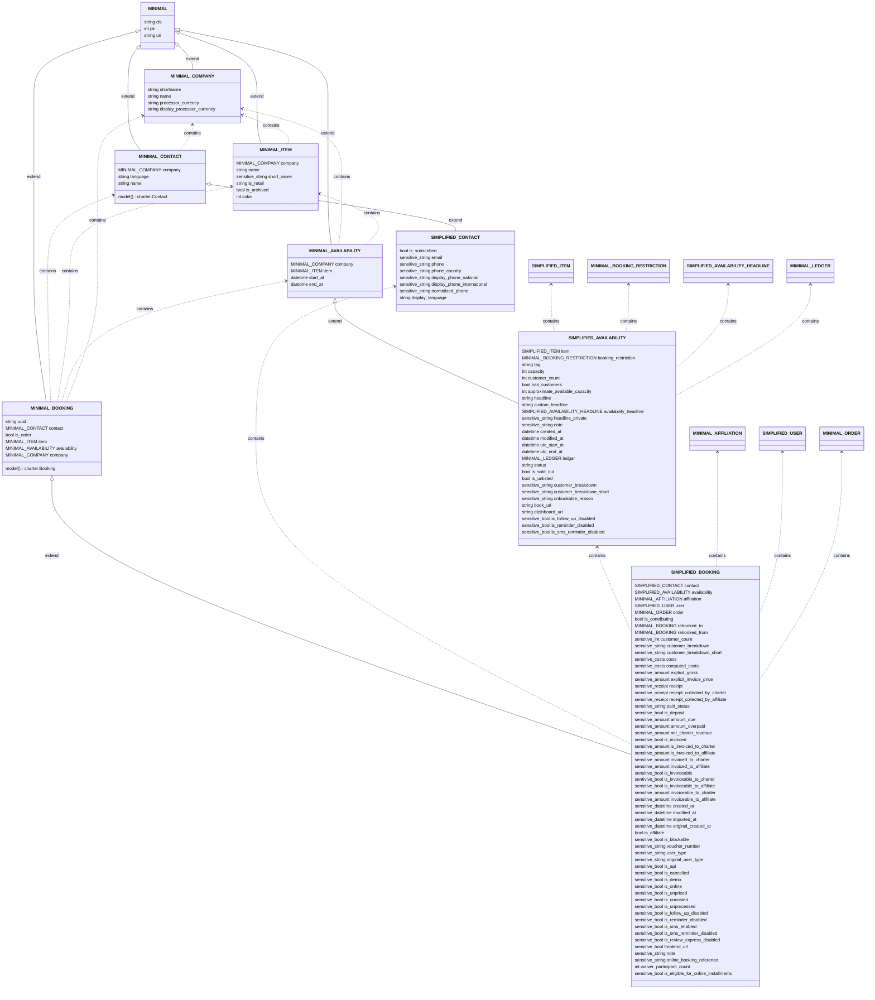

```mermaid
classDiagram
  direction BT

  
  class SIMPLIFIED_BOOKING {
    SIMPLIFIED_CONTACT contact
    SIMPLIFIED_AVAILABILITY availability
    MINIMAL_AFFILIATION affiliation
    SIMPLIFIED_USER user
    MINIMAL_ORDER order
    bool is_contributing
    MINIMAL_BOOKING rebooked_to
    MINIMAL_BOOKING rebooked_from
    sensitive_int customer_count
    sensitive_string customer_breakdown
    sensitive_string customer_breakdown_short
    sensitive_costs costs
    sensitive_costs computed_costs
    sensitive_amount explicit_gross
    sensitive_amount explicit_invoice_price
    sensitive_receipt receipt
    sensitive_receipt receipt_collected_by_charter
    sensitive_receipt receipt_collected_by_affiliate
    sensitive_string paid_status
    sensitive_bool is_deposit
    sensitive_amount amount_due
    sensitive_amount amount_overpaid
    sensitive_amount net_charter_revenue
    sensitive_bool is_invoiced
    sensitive_amount is_invoiced_to_charter
    sensitive_amount is_invoiced_to_affiliate
    sensitive_amount invoiced_to_charter
    sensitive_amount invoiced_to_affiliate
    sensitive_bool is_invoiceable
    sentivive_bool is_invoiceable_to_charter
    sensitive_bool is_invoiceable_to_affiliate
    sensitive_amount invoiceable_to_charter
    sensitive_amount invoiceable_to_affiliate
    sensitive_datetime created_at
    sensitive_datetime modified_at
    sensitive_datetime imported_at
    sensitive_datetime original_created_at
    bool is_affiliate
    sensitive_bool is_blockable
    sensitive_string voucher_number
    sensitive_string user_type
    sensitive_string original_user_type
    sensitive_bool is_api
    sensitive_bool is_cancelled
    sensitive_bool is_demo
    sensitive_bool is_online
    sensitive_bool is_unpriced
    sensitive_bool is_uncosted
    sensitive_bool is_unprocessed
    sensitive_bool is_follow_up_disabled
    sensitive_bool is_reminder_disabled
    sensitive_bool is_sms_enabled
    sensitive_bool is_sms_reminder_disabled
    sensitive_bool is_review_express_disabled
    sensitive_bool frontend_url
    sensitive_string note
    sensitive_string online_booking_reference
    int waiver_participant_count
    sensitive_bool is_eligible_for_online_installments
  }
  SIMPLIFIED_BOOKING --|> MINIMAL_BOOKING : extend
  SIMPLIFIED_BOOKING ..> SIMPLIFIED_CONTACT : contains
  SIMPLIFIED_BOOKING ..> SIMPLIFIED_AVAILABILITY : contains
  SIMPLIFIED_BOOKING ..> MINIMAL_AFFILIATION : contains
  SIMPLIFIED_BOOKING ..> SIMPLIFIED_USER : contains
  SIMPLIFIED_BOOKING ..> MINIMAL_ORDER : contains
  
  class SIMPLIFIED_CONTACT {
    bool is_subscribed
    sensitive_string email
    sensitive_string phone
    sensitive_string phone_country
    sensitive_string display_phone_national
    sensitive_string display_phone_international
    sensitive_string normalized_phone
    string display_language
  }
  SIMPLIFIED_CONTACT --|> MINIMAL_CONTACT : extend
  
  class SIMPLIFIED_AVAILABILITY {
    SIMPLIFIED_ITEM item
    MINIMAL_BOOKING_RESTRICTION booking_restriction
    string tag
    int capacity
    int customer_count
    bool has_customers
    int approximate_available_capacity
    string headline
    string custom_headline
    SIMPLIFIED_AVAILABILITY_HEADLINE availability_headline
    sensitive_string headline_private
    sensitive_string note
    datetime created_at
    datetime modified_at
    datetime utc_start_at
    datetime utc_end_at
    MINIMAL_LEDGER ledger
    string status
    bool is_sold_out
    bool is_unlisted
    sensitive_string customer_breakdown
    sensitive_string customer_breakdown_short
    sensitive_string unbookable_reason
    string book_url
    string dashboard_url
    sensitive_bool is_follow_up_disabled
    sensitive_bool is_reminder_disabled
    sensitive_bool is_sms_reminder_disabled
  }
  SIMPLIFIED_AVAILABILITY --|> MINIMAL_AVAILABILITY : extend
  SIMPLIFIED_AVAILABILITY ..> SIMPLIFIED_ITEM : contains
  SIMPLIFIED_AVAILABILITY ..> MINIMAL_BOOKING_RESTRICTION : contains
  SIMPLIFIED_AVAILABILITY ..> SIMPLIFIED_AVAILABILITY_HEADLINE : contains
  SIMPLIFIED_AVAILABILITY ..> MIMIMAL_LEDGER : contains
  
  class MINIMAL_BOOKING {
    string uuid
    MINIMAL_CONTACT contact
    bool is_order
    MINIMAL_ITEM item
    MINIMAL_AVAILABILITY availability
    MINIMAL_COMPANY company
    model() charter.Booking
  }
  MINIMAL_BOOKING --|> MINIMAL : extend
  MINIMAL_BOOKING ..> MINIMAL_CONTACT : contains
  MINIMAL_BOOKING ..> MINIMAL_ITEM : contains
  MINIMAL_BOOKING ..> MINIMAL_AVAILABILITY : contains
  MINIMAL_BOOKING ..> MINIMAL_COMPANY : contains
  
  class MINIMAL_CONTACT {
    MINIMAL_COMPANY company
    string language
    string name
    model() charter.Contact
  }
  MINIMAL_CONTACT --|> MINIMAL : extend
  MINIMAL_CONTACT ..> MINIMAL_COMPANY : contains
  
  class MINIMAL_ITEM {
    MINIMAL_COMPANY company
    string name
    sensitive_string short_name
    string is_retail
    bool is_archived
    int color
  }
  MINIMAL_ITEM --|> MINIMAL : extend
  MINIMAL_ITEM ..> MINIMAL_COMPANY : contains
  
  class MINIMAL_AVAILABILITY {
    MINIMAL_COMPANY company
    MINIMAL_ITEM item
    datetime start_at
    datetime end_at
  }
  MINIMAL_AVAILABILITY --|> MINIMAL : extend
  MINIMAL_AVAILABILITY ..> MINIMAL_COMPANY : contains
  MINIMAL_AVAILABILITY ..> MINIMAL_ITEM : contains
  
  class MINIMAL_COMPANY {
    string shortname
    string name
    string processor_currency
    string display_processor_currency
  }
  MINIMAL_COMPANY --|> MINIMAL : extend
  
  class MINIMAL {
    string cls
    int pk
    string uri
  }

```
